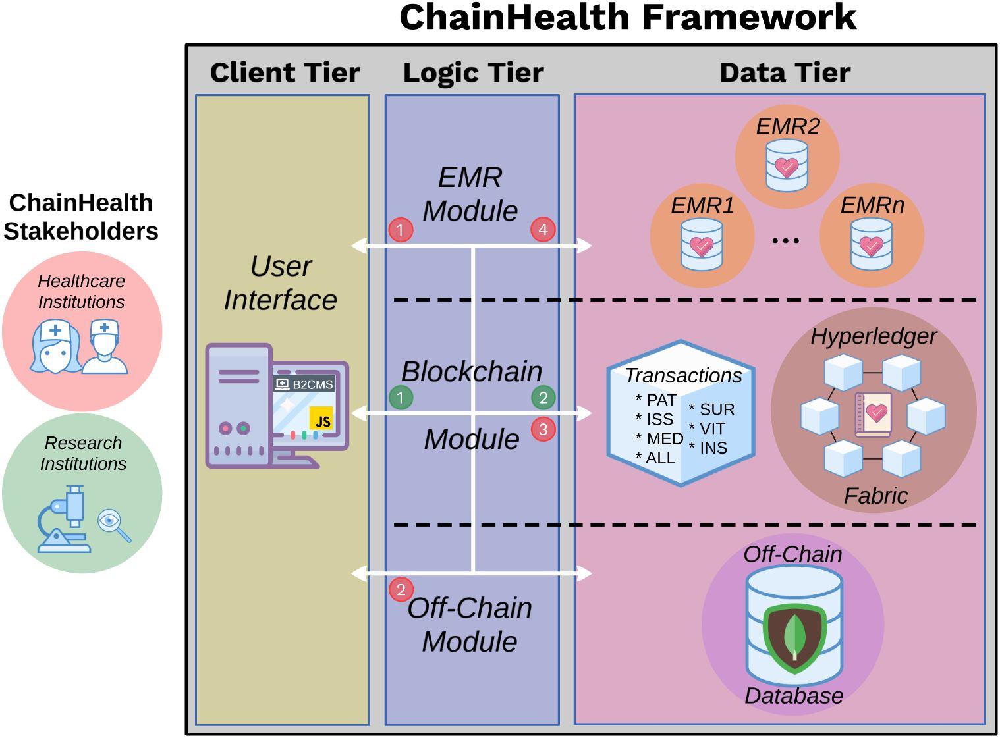

# ChainHealth
This repository contains the necessary components to instantiate ChainHealth application. ChainHealth is a blockchain-based web application that integrates multiple instances of Electronic Medical Records (EMRs) and IoT devices (MySignals) with blockchain technology. 
<p align="center">
  
</p>

## Getting Started
* Optional: Although IoT devices are not needed to operate ChainHealth, you can deploy the [MySignals](http://www.my-signals.com/) IoT prototype and its components by following the steps shown [here](./mysignals_hardware/).

1. Install the following software and packages:
    - Docker & Docker Compose.
    - NodeJS & NPM.
    - Python3.
        - pyOpenSSL.
        - argparse.
1. Clone and deploy [Blockchain_Manager](https://github.com/jacastillo8/Blockchain_Manager) tool.
1. Move `medical_contract` folder to `Blockchain_Manager/blockchain_base/chaincode` so that the smart contract can be properly instantiated in the blockchain.
1. Load collection `postman_collection_chainhealth` into Postman.
    - Register ChainHealth blockchain (`Register`), which includes 3 organizations denoted as Hospital X, Clinic Y and Research Z.
    - Build ChainHealth blockchain (`Build`). Large blockchains may require larger times to deploy, thus, to avoid sending multiple build requests while waiting, just cancel the request after sending it. The blockchain will continue to deploy in the background. 
1. Navigate to `express_app` folder and install node dependencies.
    ```bash
    cd express_app
    npm install
    ```
1. Add/modify information from `config.yaml` (found inside `express_app`), i.e., change host/port values for each component, etc. The current file matches the number of organizations of the built blockchain. 
1. You are now ready to deploy ChainHealth.

### NPM commands to deploy ChainHealth components
```bash
# To run ChainHealth Service
npm run mongoUp        # Generates MongoDB container to store chainhealth assets
npm run emrUp          # Generates 2 EMR containers, i.e., OpenEMR 
npm run brokerUp       # Generates 2 Mosquitto MQTT brokers (one for each EMR)
npm start              # Starts ChainHealth service
# Remove all containers
npm run clean
```

### EMR prior configuration
To enable proper communication between an EMR instance ([OpenEMR](https://www.open-emr.org/)) and ChainHealth you are required to do the following:
* Note that you are required to follow these steps for each of the EMR containers in the network.
1. Navigate to the EMR website, i.e., `http://X.X.X.X:Y/openemr`, where X.X.X.X denotes the assigned IP address for that particular EMR and Y indicates its port. 
1. Click on `Proceed to Step 1`.
1. Select **Have setup create the database** and click on `Proceed to Step 2`.
1. Under _MySQL Server Details_, fill the password (i.e., openemr) and set the **Root Password**. 
    - For simplicity, the code has generated default root passwords for each EMR container and they can be found inside the `express_app/emr/.env` file. However, this can be modified by changing the `ComposeEMR` class in emr_docker.py. 
1. Under _OpenEMR Initial User Details_ make sure to introduce your username and password and click `Create DB and User`. This will take a couple of minutes to complete.
1. After the set-up has been completed, continue to click on `Proceed to Step 4-6`.
1. Click on `Proceed to Select a Theme` and select **Keep Current** to proceed to the final step.
1. Select `Click here to start using OpenEMR` to finalize the set-up process of OpenEMR.
1. Next, we require to enable the REST API in order to communicate with the EMR.
    - Input username and password. 
    - Go to Administration -> Globals -> Connectors and select **Enable OpenEMR REST API**. 
    - Click Save and proceed to exit OpenEMR since we no longer need to directly interact with it.
1. You now can interact with the ChainHealth service by navigating to `http://X.X.X.X:3000`.