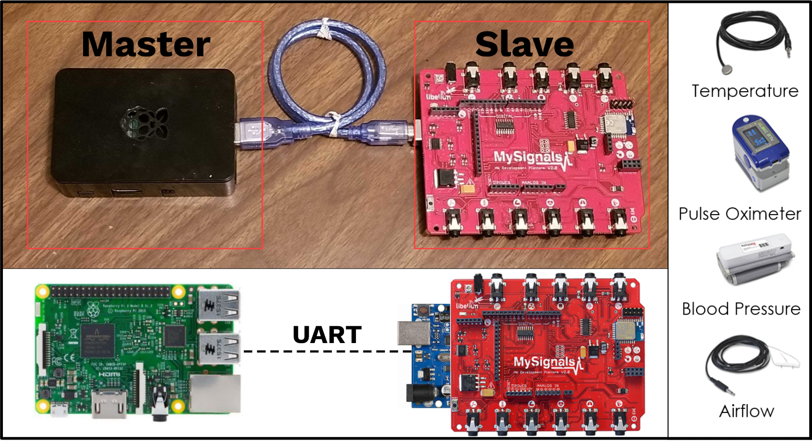

# Hardware set-up
The IoT prototype presented here is comprised of a Raspberry Pi 3 and an Arduino UNO operating the [MySignals](http://www.my-signals.com/) platform. 

  

## Getting Started
1. Install the following software and packages:
    - Arduino IDE.
        - Load `MSPrint` and `MySignals` libraries found in `./Arduino/libraries`.
    - Python3.
        - pyserial.
        - paho-mqtt.
        - getmac.
        - [gpiozero](https://gpiozero.readthedocs.io/en/stable/installing.html)
1. Mount MySignals to Arduino UNO and connect UNO to Raspberry Pi using USB cable
    - Load `sensor_sketch` into Arduino UNO.
1. Connect [LED traffic light](https://www.amazon.com/Pi-Traffic-Light-Raspberry-pack/dp/B00RIIGD30) and [push button](https://www.amazon.com/Youliang-unidades-Interruptor-Breakout-Raspberry/dp/B07TBKTGR3/ref=sr_1_1_sspa?keywords=push+button+module+for+arduino&qid=1656529514&s=electronics&sprefix=push+button+module%2Celectronics%2C78&sr=1-1-spons&psc=1&spLa=ZW5jcnlwdGVkUXVhbGlmaWVyPUEzRFVURkpKQUJDWjVCJmVuY3J5cHRlZElkPUEwMzgyNjI2MlZIREswSkQ4V0tUSSZlbmNyeXB0ZWRBZElkPUEwNTcyODIzMTFNWVdFR0dUR0ZEViZ3aWRnZXROYW1lPXNwX2F0ZiZhY3Rpb249Y2xpY2tSZWRpcmVjdCZkb05vdExvZ0NsaWNrPXRydWU=) into Raspberry Pi. The traffic light is used to illustrate different connectivity modes of the IoT device (i.e., green = connected, yellow = pending, and red = denied), while the push button is used to send a connectivity request to ChainHealth. 
    - green -> GPIO 14.
    - yellow -> GPIO 18.
    - red -> GPIO 15.
    - button -> GPIO 2.
1. Run `main.py` from `./Pi` folder with arguments `-h X.X.X.X -p Y`, where X.X.X.X and Y illustrate the IP address and port of the ChainHealth service, respectively.